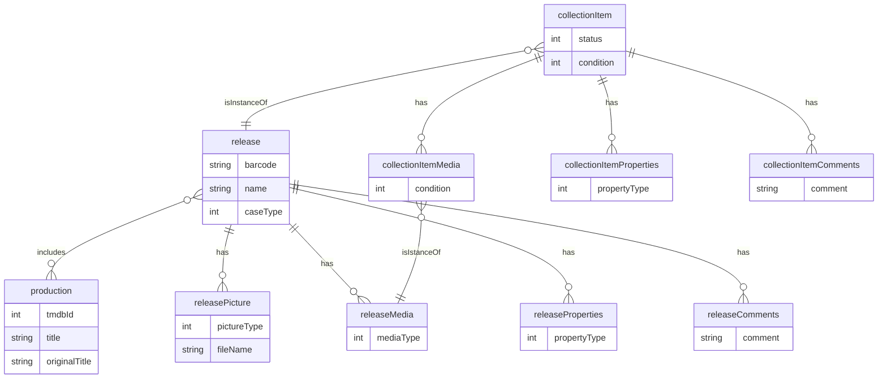

# film_freak

*film_freak* is WIP name for my collection management app which is mostly focusing on managing a movie collection but might support other types of media in future (games, music, books, comics etc).

It is desgined to be an off-line first app with synchronization to an online database.

## Tech

It's implemented with [Flutter SDK](https://flutter.dev/) using [Dart](https://dart.dev/) programming language and with [bloc-library](https://bloclibrary.dev) to implement BLoC pattern. This is my first serious attempt with Flutter and I must say I'm quite impressed with it. I really enjoy developing with Flutter and Dart.

Currently data is saved to a local [SQLite](https://www.sqlite.org) database and I'm implementing a data synchronization with online database and user accounts through REST API: https://github.com/zorrokid/film-freak-api

One of the features I've been focusing from the start is using [Google ML Kit](https://developers.google.com/ml-kit) to recognize text from images and implementing a widget to fill textual form fields by selecting text directly from a image.

[Firebase Remote Config](https://firebase.google.com/docs/remote-config) is used for storing configurations such as API keys.

[The Movie Database API](https://developers.themoviedb.org) is used to fetch movie data for movie releases in collection.

Currently developing this only for Android target since possible to test only with Android devices.

## Features

Some of the features currently implemented are:
- Search or add collection items by scanning a barcode using system camera
- Use system camera to add images to collection item
- Fill text fields by selecting text from active image 
    - Text from image can be selected by blocks of text or by words
- Select quadrilateral (four sided polygon) from image and translate it to a rectangle with selected aspect ratio (based on collection item case type)
- Assign different kind of properties for collection item
- Fill in the basic info related to collection item (such as release name, media type, case type and condition)
- Store items to local database
- Search TMDB API for movies - search text can be selected from active image

## Data model

## Build & Run

To build, install and run this app you need to (more comprehensive instructions will be added later):
- [Install Flutter SDK](https://docs.flutter.dev/get-started/install)
- [Install Firebase related tools and register app to a Firebase account](https://firebase.google.com/docs/flutter/setup?platform=android)
- [Install to your device](https://docs.flutter.dev/deployment/android#install-an-apk-on-a-device)
- To run unit tests sqlite3 development libraries have to be installed.

## Tests

My goal is to test especially blocs. Unit tests can be found under test-folder and can be run with:

    flutter test

To update mockito-mocks:

    dart run build_runner build